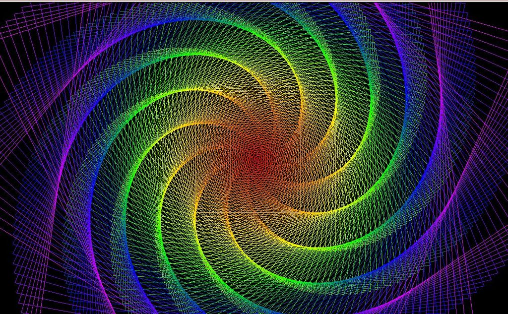

# DESCRIPTION
This is a turtle program that allows the users to be given many options to create their own custom or randomly generated graphic!

# INSTRUCTIONS 
If you have python installed, simply download the .py file and run it.
If you wish to use this program without python installed, simply download the .exe installer file.

# ADDITIONAL
You can also visit the website - 

 
